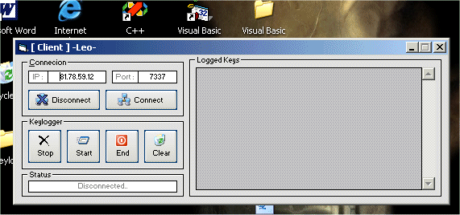



## Remote Keylogger ByLeo

### Description

This is an example of a keylogger using winsock. It's a client/server application and also my first upload to PSC. Please leave comments.
 
### More Info
 

             |
---                |---
**Submitted On**   |2004-09-16 06:30:22
**By**             |[UkLeo](https://github.com/Planet-Source-Code/PSCIndex/blob/master/ByAuthor/ukleo.md)
**Level**          |Intermediate
**User Rating**    |4.6 (41 globes from 9 users)
**Compatibility**  |VB 6\.0
**Category**       |[Miscellaneous](https://github.com/Planet-Source-Code/PSCIndex/blob/master/ByCategory/miscellaneous__1-1.md)
**World**          |[Visual Basic](https://github.com/Planet-Source-Code/PSCIndex/blob/master/ByWorld/visual-basic.md)
**Archive File**   |[Remote\_Key1794869172004\.zip](https://github.com/Planet-Source-Code/ukleo-remote-keylogger-byleo__1-56230/archive/master.zip)

